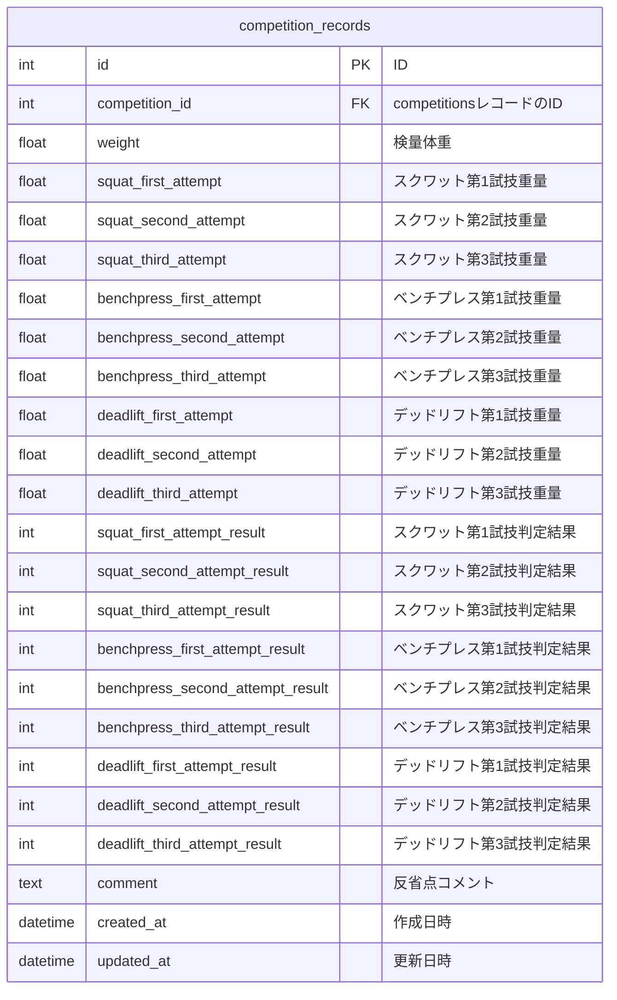

### はじめに
プログラミングスクールRUNTEQ卒業生のおかかチーズと申します。([@Yoo_pr](https://x.com/Yoo_pr))
RUNTEQアドベントカレンダー2024🎄 24日目を担当致します。

https://qiita.com/advent-calendar/2024/runteq

ポートフォリオで、私が5年ほど続けている競技「パワーリフティング」の試技結果が記録・管理ができるサービスを制作しました。
サービス名: [PowerLifter's Log](https://www.powerlifterslog.com/)
GitHub: https://github.com/okaka-c/goodlifterlog

サービスでの工夫ポイントは、ユーザビリティ向上のために
試技結果の入力フォームをステップ入力フォーム形式にしたことです。
本記事ではRuby on RailsのAction Viewテンプレート `ERBビューテンプレート`を用いた
ステップ入力フォームの実装方法と、画面設計をする際にUI/UX設計面で考えた事をまとめました。

:::note warn
**記事を読むうえでの注意点**

Ruby on Rails、画面のデザインやUI/UX設計については経験が浅く、一部おかしな記述があるかもしれません。
そのためもし間違いなどがありましたらご指摘いただけると幸いです。よろしくお願いします。
:::

### 環境
| カテゴリ | 技術 |
| --- | --- |
| PC | MacBook Air M2 |
| 開発環境 | Docker |
| フロントエンド |TailwindCSS, daisyUI|
| バックエンド | Ruby 3.2.2 / Ruby on Rails 7.0.8.1 |
| データベース | PostgreSQL |

### この記事でわかること
- ステップ入力フォームとは何か概要説明
- 作ったサービスに採用することになった経緯
- ステップ入力フォームの `UI/UX設計`で意識するポイント
- Ruby on Railsの以下の機能を使ったステップ入力フォームの実装方法
  -  `session`メソッド
  - `ActiveModel::Modelモジュール`
  - `ActiveModel::Validationsモジュール`

### ステップ入力フォームとは
入力フォームを1ページにすべて表示するのではなく、いくつかのステップに分割して順番に表示する形式です。
複数の入力項目を1ページにまとめるとフォームが長くなり、ユーザーにとって見にくく、入力の心理的ハードルが上がることがあります。

例えば、以下のイメージ画像の左側には、氏名、メールアドレス、パスワード、住所情報、クレジットカード情報を1ページにまとめた会員登録フォームがあります。
これを画像のように「ユーザー情報」「住所情報」「クレジットカード情報」の3つに分け、それぞれをステップごとに順番に入力する形式にしたものがステップ入力フォームです。

詳しい内容やメリットについては、以下の参考サイトで詳しく解説されていますので、ぜひご覧ください。本記事では詳細な説明を割愛します。

https://ds-b.jp/dsmagazine/what-is-stepform/

### 作ったサービスに採用することになった経緯
パワーリフティングとは、スクワット、ベンチプレス、デッドリフトの3種目の挙上重量の合計値で順位を決めます。
各種目とも3回の試技に挑戦でき、試技ごとに審判が成功か失敗か判定をします。
試技結果の入力項目に必要なものは以下の通りです。
- **検量体重**：試合開始前に公式に測定された体重
- **各種目の試技重量値**：第一試技〜第三試技で挙上を試みた重量
- **各試技の判定結果**：成功または失敗の判定
- **振り返り用コメント**：試技や大会全体についてのメモ

これらの入力フォームを、サービスのMVPリリース時点で1ページにまとめていました。
それが以下の画像になります。
**※【before】MVPリリース時点の入力フォーム**

**複数入力フォームを1ページにまとめた場合の問題点**
- **実際の使用シーンを想定すると、視線が散りやすく、入力途中の負担が大きい**
  スマホでの使用を想定すると、ユーザーはサービスの入力画面と試技結果が記載された手書きメモや大会結果表を
  交互に見ながら情報を入力します。
  スマホの小さな画面では、フォーム全体をスクロールしながら入力と確認を行う必要があり、負担が増加します。
  さらに、入力途中で「どこまで入力したか」が分かりにくくなり、完了までのストレスが大きくなる可能性があります。

**上記の問題点を解決するためにステップ入力フォーム形式を採用**
画面遷移数が多くなる欠点はありますが、採用すると以下のメリットがありますので採用することにしました。
- **1ページあたりの入力項目を減らすことで負担軽減**
  - 1画面に表示される項目が限定されるため、スクロールを最小限にすることができます。
  - ステップごとに進行状況が明確になるため、入力の途中で「どこまで入力したか分からない」という状況を防げます。

ページの分割方法や、画面設計面については後述しますが ステップ入力フォーム化後の`after`は以下画像のようになりました。
**※【after】ステップ入力フォーム採用後**

### 概要(ステップ入力の全体像とゴール)
本記事でこれから解説するステップ入力フォームで受け取るデータは、`competition_records`テーブルに保存されます。
このテーブルは、各種試技結果や反省コメントなど、パワーリフティング競技の記録を管理するために使用されます。

competition_recordsテーブル用の入力フォームを5ステップに分割します。
1. 検量体重入力フォーム
2. スクワット試技結果入力フォーム
3. ベンチプレス試技結果入力フォーム
4. デッドリフト試技結果入力フォーム
5. コメント試技結果入力フォーム

各ステップに対応するテーブルのカラムは以下の通りです。

#### ステップ構成と対応カラム
| ステップ                     | 対応カラム                                                                                      |
|------------------------------|---------------------------------------------------------------------------------------------|
| **1.検量体重入力フォーム**     | - `weight` ("検量体重")                                                                      |
| **2.スクワット試技結果入力フォーム** | - `squat_first_attempt` ("第1試技重量")    - `squat_second_attempt` ("第2試技重量")   - `squat_third_attempt` ("第3試技重量")    - `squat_first_attempt_result` ("第1試技判定結果")    - `squat_second_attempt_result` ("第2試技判定結果")    - `squat_third_attempt_result` ("第3試技判定結果") |
| **3.ベンチプレス試技結果入力フォーム** | - `benchpress_first_attempt` ("第1試技重量")    - `benchpress_second_attempt` ("第2試技重量")    - `benchpress_third_attempt` ("第3試技重量")    - `benchpress_first_attempt_result` ("第1試技判定結果")    - `benchpress_second_attempt_result` ("第2試技判定結果")    - `benchpress_third_attempt_result` ("第3試技判定結果") |
| **4.デッドリフト試技結果入力フォーム** | - `deadlift_first_attempt` ("第1試技重量")    - `deadlift_second_attempt` ("第2試技重量")    - `deadlift_third_attempt` ("第3試技重量")    - `deadlift_first_attempt_result` ("第1試技判定結果")    - `deadlift_second_attempt_result` ("第2試技判定結果")    - `deadlift_third_attempt_result` ("第3試技判定結果") |
| **5.コメント入力フォーム**       | - `comment` ("反省点コメント")                                                               |

#### 実装条件
- **バリデーションと画面遷移**
各フォームでは入力データのバリデーションを実行し、成功すれば次のフォームへ遷移します。バリデーションに失敗した場合は、ユーザーに再入力を促します。

- **データ保存のタイミング**
各フォームの段階ではデータベースに保存せず、最後のステップが完了した時点で全てのデータを一括してデータベースに保存します。

### 実装概要
概要で記載されたゴール・条件に向けて、おおまかな実装手順を以下に示します。
[参考記事: ステップフォームの使い方](https://edito.jp/corporate/231220/#i-3:~:text=%E8%B2%A2%E7%8C%AE%E3%81%97%E3%81%BE%E3%81%99%E3%80%82-,%E3%82%B9%E3%83%86%E3%83%83%E3%83%97%E3%83%95%E3%82%A9%E3%83%BC%E3%83%A0%E3%81%AE%E4%BD%BF%E3%81%84%E6%96%B9,-%E3%81%A7%E3%81%AF%E5%AE%9F%E9%9A%9B%E3%81%AB)

**1\. ステップ入力フォームの画面計画**
**2\. UIのデザイン設計**
**4\. 【Rails側】モデルの作成**
**5\. 【Rails側】コントローラの作成**
**6\. 【Rails側】ルーティングの設定**
**7\. 【Rails側】ビューファイルの作成**

### 実装詳細
#### 1\. ステップ入力フォームの画面計画
複数の入力項目をグループ分けし、ステップ数を決めます。
`competition_records`テーブル用の入力フォームを5ステップに分割しました。
1. 検量体重入力フォーム
2. スクワット試技結果入力フォーム
3. ベンチプレス試技結果入力フォーム
4. デッドリフト試技結果入力フォーム
5. コメント試技結果入力フォーム

#### 2\. UIのデザイン設計
各ステップの画面設計をします。
- **意識したこと**
  - **⭐️完了までのステップと進捗状況を表示**
  ステップ入力フォームには重要だと思います。あとどれくらいか？今どこの入力か？という情報が一目でわかるので、ユーザーの心理的な負担が軽減されるようです。
  [参考記事: 8. 完了までのステップを表示](https://blog.hubspot.jp/marketing/top-5-tips-for-creating-effective-forms#:~:text=8-,.%20%E5%AE%8C%E4%BA%86%E3%81%BE%E3%81%A7%E3%81%AE%E3%82%B9%E3%83%86%E3%83%83%E3%83%97%E3%82%92%E8%A1%A8%E7%A4%BA,-%E5%87%BA%E5%85%B8%EF%BC%9A%E8%B3%87%E6%96%99)
  - **選択肢が少ない場合はラジオボタンにする**
  入力項目が多いのでいかにクリック数を減らすかを意識しています。試技判定結果(未試行or成功or失敗)を選択させる箇所はラジオボタン形式にし、ユーザービリティ向上を狙いました。
  [参考記事: ドロップダウンを多用しない](https://blog.hubspot.jp/marketing/top-5-tips-for-creating-effective-forms#:~:text=7.-,%E3%83%89%E3%83%AD%E3%83%83%E3%83%97%E3%83%80%E3%82%A6%E3%83%B3%E3%82%92%E5%A4%9A%E7%94%A8%E3%81%97%E3%81%AA%E3%81%84,-%E3%83%89%E3%83%AD%E3%83%83%E3%83%97%E3%83%80%E3%82%A6%E3%83%B3%E3%81%AF)
  - **バリデーションエラー表示は入力欄の近くに表示**
  管理ツールなので、データの整合性を担保するために一つの入力項目に対しバリデーションを何種類か定義しています。
  何がどの様に間違っているかユーザーにわかりやすく伝えるために、エラーメッセージはページの上部に１箇所にまとめるのではなく、
  入力フォームの近くに表示させました。
  [参考記事: エラー表示は入力欄の近くに表示](https://blog.hubspot.jp/marketing/top-5-tips-for-creating-effective-forms#:~:text=10.-,%E3%82%A8%E3%83%A9%E3%83%BC%E8%A1%A8%E7%A4%BA%E3%81%AF%E5%85%A5%E5%8A%9B%E6%AC%84%E3%81%AE%E8%BF%91%E3%81%8F%E3%81%AB%E8%A1%A8%E7%A4%BA,-%E5%85%A5%E5%8A%9B%E3%83%9F%E3%82%B9%E3%81%8C)

**※イメージ画像**

#### 4\. 【Rails側】モデルの作成
#### 5\. 【Rails側】コントローラの作成
#### 6\. 【Rails側】ルーティングの設定
#### 7\. 【Rails側】ビューファイルの作成

### おわりに

### 参考文献
https://ds-b.jp/dsmagazine/what-is-stepform/
https://edito.jp/corporate/231220/