# はじめに
プログラミングスクールRUNTEQ卒業生のおかかチーズと申します。([@Yoo_pr](https://x.com/Yoo_pr))
RUNTEQアドベントカレンダー2024🎄 24日目を担当致します。

https://qiita.com/advent-calendar/2024/runteq

ポートフォリオで、私が5年ほど続けている競技「パワーリフティング」の試技結果が記録・管理ができるサービスを制作しました。
サービス名: [PowerLifter's Log](https://www.powerlifterslog.com/)
GitHub: https://github.com/okaka-c/goodlifterlog

サービスでの工夫ポイントは、20項目に及ぶ入力フォームをステップ入力フォーム形式に変更し、ユーザビリティを向上させたことです。
本記事ではRuby on RailsのAction Viewテンプレート `ERBビューテンプレート`を用いた
ステップ入力フォームの実装方法と、画面設計をする際にUI/UX設計面で考えた事をまとめました。

:::note warn
**記事を読むうえでの注意点**

Ruby on Rails、画面のデザインやUI/UX設計については経験が浅く、一部おかしな記述があるかもしれません。
そのためもし間違いなどがありましたらご指摘いただけると幸いです。よろしくお願いします。
:::

# 環境
| カテゴリ | 技術 |
| --- | --- |
| PC | MacBook Air M2 |
| 開発環境 | Docker |
| フロントエンド |TailwindCSS, daisyUI|
| バックエンド | Ruby 3.2.2 / Ruby on Rails 7.0.8.1 |
| データベース | PostgreSQL |

# この記事でわかること
- ステップ入力フォームとは何か概要説明
- 作ったサービスに採用することになった経緯
- ステップ入力フォームの `UI/UX設計`で意識するポイント
- Ruby on Railsの以下の機能を使ったステップ入力フォームの実装方法
  -  `session`メソッド
  - `ActiveModel::Modelモジュール`
  - `ActiveModel::Validationsモジュール`


# ステップ入力フォームとは
入力フォームを1ページにすべて表示するのではなく、いくつかのステップに分割して順番に表示する形式です。
複数の入力項目を1ページにまとめるとフォームが長くなり、ユーザーにとって見にくく、入力の心理的ハードルが上がることがあります。

例えば、以下のイメージ画像の左側には、氏名、メールアドレス、パスワード、住所情報、クレジットカード情報を1ページにまとめた会員登録フォームがあります。
これを画像のように「ユーザー情報」「住所情報」「クレジットカード情報」の3つに分け、それぞれをステップごとに順番に入力する形式にしたものがステップ入力フォームです。


詳しい内容やメリットについては、以下の参考サイトで詳しく解説されていますので、ぜひご覧ください。本記事では詳細な説明を割愛します。

https://ds-b.jp/dsmagazine/what-is-stepform/

# 作ったサービスに採用することになった経緯
## 20項目の入力フォームを1ページにまとめた場合の問題点
パワーリフティングとは、スクワット、ベンチプレス、デッドリフトの3種目の挙上重量の合計値で順位を決めます。
各種目とも3回の試技に挑戦でき、試技ごとに審判が成功か失敗か判定をします。
試技結果の入力項目に必要なものは以下の通りです。
- **検量体重**：試合開始前に公式に測定された体重
- **各種目の試技重量値**：第一試技〜第三試技で挙上を試みた重量
- **各試技の判定結果**：成功または失敗の判定
- **振り返り用コメント**：試技や大会全体についてのメモ

これらの入力フォームを、サービスのMVPリリース時点で1ページにまとめていました。
それが以下の画像になります。
**※【before】MVPリリース時点の入力フォーム**


- **実際の使用シーンを想定すると、視線が散りやすく、入力途中の負担が大きい**
  スマホでの使用を想定すると、ユーザーはサービスの入力画面と試技結果が記載された手書きメモや大会結果表を交互に見ながら情報を入力します。
  スマホの小さな画面では、フォーム全体をスクロールしながら入力と確認を行う必要があり、負担が増加します。
  さらに、入力途中で「どこまで入力したか」が分かりにくくなり、完了までのストレスが大きくなる可能性があります。
## 問題点を解決するためにステップ入力フォーム形式を採用
画面遷移数が多くなる欠点はありますが、採用すると以下のメリットがありますので採用することにしました。
- **1ページあたりの入力項目を減らすことで負担軽減**
  - 1画面に表示される項目が限定されるため、スクロールを最小限にすることができます。
  - ステップごとに進行状況が明確になるため、入力の途中で「どこまで入力したか分からない」という状況を防げます。
ページの分割方法や、画面設計面については後述しますが ステップ入力フォーム化後の`after`は以下画像のようになりました。
**※【after】ステップ入力フォーム採用後**


# 概要(ステップ入力の全体像とゴール)
本記事でこれから解説するステップ入力フォームで受け取るデータは、`competition_records`テーブルに保存されます。
このテーブルは、各種試技結果や反省コメントなど、パワーリフティング競技の記録を管理するために使用されます。

```mermaid
erDiagram
  competition_records {
          int id PK "ID"
          int competition_id FK "competitionsレコードのID"
          float weight "検量体重"
          float squat_first_attempt "スクワット第1試技重量"
          float squat_second_attempt "スクワット第2試技重量"
          float squat_third_attempt "スクワット第3試技重量"
          float benchpress_first_attempt "ベンチプレス第1試技重量"
          float benchpress_second_attempt "ベンチプレス第2試技重量"
          float benchpress_third_attempt "ベンチプレス第3試技重量"
          float deadlift_first_attempt "デッドリフト第1試技重量"
          float deadlift_second_attempt "デッドリフト第2試技重量"
          float deadlift_third_attempt "デッドリフト第3試技重量"
          int squat_first_attempt_result "スクワット第1試技判定結果"
          int squat_second_attempt_result "スクワット第2試技判定結果"
          int squat_third_attempt_result "スクワット第3試技判定結果"
          int benchpress_first_attempt_result "ベンチプレス第1試技判定結果"
          int benchpress_second_attempt_result "ベンチプレス第2試技判定結果"
          int benchpress_third_attempt_result "ベンチプレス第3試技判定結果"
          int deadlift_first_attempt_result "デッドリフト第1試技判定結果"
          int deadlift_second_attempt_result "デッドリフト第2試技判定結果"
          int deadlift_third_attempt_result "デッドリフト第3試技判定結果"
          text comment "反省点コメント"
          datetime created_at "作成日時"
          datetime updated_at "更新日時"
      }
```

competition_recordsテーブル用の入力フォームを5ステップに分割します。
1. 検量体重入力フォーム
2. スクワット試技結果入力フォーム
3. ベンチプレス試技結果入力フォーム
4. デッドリフト試技結果入力フォーム
5. コメント試技結果入力フォーム

各ステップに対応するテーブルのカラムは以下の通りです。

## ステップ構成と対応カラム
| ステップ                     | 対応カラム                                                                                      |
|------------------------------|---------------------------------------------------------------------------------------------|
| **1.検量体重入力フォーム**     | - `weight` ("検量体重")                                                                      |
| **2.スクワット試技結果入力フォーム** | - `squat_first_attempt` ("第1試技重量")  <br> - `squat_second_attempt` ("第2試技重量") <br> - `squat_third_attempt` ("第3試技重量")  <br> - `squat_first_attempt_result` ("第1試技判定結果")  <br> - `squat_second_attempt_result` ("第2試技判定結果")  <br> - `squat_third_attempt_result` ("第3試技判定結果") |
| **3.ベンチプレス試技結果入力フォーム** | - `benchpress_first_attempt` ("第1試技重量")  <br> - `benchpress_second_attempt` ("第2試技重量")  <br> - `benchpress_third_attempt` ("第3試技重量")  <br> - `benchpress_first_attempt_result` ("第1試技判定結果")  <br> - `benchpress_second_attempt_result` ("第2試技判定結果")  <br> - `benchpress_third_attempt_result` ("第3試技判定結果") |
| **4.デッドリフト試技結果入力フォーム** | - `deadlift_first_attempt` ("第1試技重量")  <br> - `deadlift_second_attempt` ("第2試技重量")  <br> - `deadlift_third_attempt` ("第3試技重量")  <br> - `deadlift_first_attempt_result` ("第1試技判定結果")  <br> - `deadlift_second_attempt_result` ("第2試技判定結果")  <br> - `deadlift_third_attempt_result` ("第3試技判定結果") |
| **5.コメント入力フォーム**       | - `comment` ("反省点コメント")                                                               |

## 実装条件
### **バリデーションと画面遷移**
各フォームでは入力データのバリデーションを実行し、成功すれば次のフォームへ遷移します。バリデーションに失敗した場合は、ユーザーに再入力を促します。

### **入力データをデータベースへ保存するタイミング**
各フォームの段階ではデータベースに保存せず、最後のステップが完了した時点で全てのデータを一括してデータベースに保存します。

## おおまかな流れ
**1. 検量体重入力フォーム**
- ユーザーが入力後、「次の種目」へボタンを押す
- 入力したデータのバリデーションを実行
  - 成功：スクワット入力フォームにリダイレクト
  - 失敗：検量体重入力フォームに戻り再入力させる

**2. スクワット試技結果入力フォーム**
↓ ※ステップ1と同様の処理
**3. ベンチプレス試技結果入力フォーム**
↓ ※ステップ1と同様の処理
**4. デッドリフト試技結果入力フォーム**
↓ ※ステップ1と同様の処理

**5. 振り返りコメント入力フォーム**
- 入力したデータのバリデーションを実行
- 成功：ステップ1~5で取得したデータをデータベースへ一括保存


## 実装概要
概要で記載されたゴール・条件に向けて、おおまかな実装手順を以下に示します。
[参考記事: ステップフォームの使い方](https://edito.jp/corporate/231220/#i-3:~:text=%E8%B2%A2%E7%8C%AE%E3%81%97%E3%81%BE%E3%81%99%E3%80%82-,%E3%82%B9%E3%83%86%E3%83%83%E3%83%97%E3%83%95%E3%82%A9%E3%83%BC%E3%83%A0%E3%81%AE%E4%BD%BF%E3%81%84%E6%96%B9,-%E3%81%A7%E3%81%AF%E5%AE%9F%E9%9A%9B%E3%81%AB)

**1\. ステップ入力フォームの画面計画**
**2\. UIのデザイン設計**
**4\. 【Rails側】モデルの作成**
**5\. 【Rails側】コントローラの作成**
**6\. 【Rails側】ルーティングの設定**
**7\. 【Rails側】ビューファイルの作成**

## 実装詳細
※ **6.【Rails側】ルーティングの設定**と**7.【Rails側】ビューファイルの作成**は詳細な実装説明は割愛致します。
### 1\. ステップ入力フォームの画面計画
複数の入力項目をグループ分けし、ステップ数を決めます。
`competition_records`テーブル用の入力フォームを5ステップに分割しました。
1. 検量体重入力フォーム
2. スクワット試技結果入力フォーム
3. ベンチプレス試技結果入力フォーム
4. デッドリフト試技結果入力フォーム
5. 振り返りコメント入力フォーム

### 2\. UIのデザイン設計
各ステップの画面設計をします。
#### **意識したこと**
  - **⭐️完了までのステップと進捗状況を表示**
  ステップ入力フォームには重要だと思います。あとどれくらいか？今どこの入力か？という情報が一目でわかるので、ユーザーの心理的な負担が軽減されるようです。
  [参考記事: 8. 完了までのステップを表示](https://blog.hubspot.jp/marketing/top-5-tips-for-creating-effective-forms#:~:text=8-,.%20%E5%AE%8C%E4%BA%86%E3%81%BE%E3%81%A7%E3%81%AE%E3%82%B9%E3%83%86%E3%83%83%E3%83%97%E3%82%92%E8%A1%A8%E7%A4%BA,-%E5%87%BA%E5%85%B8%EF%BC%9A%E8%B3%87%E6%96%99)
  - **選択肢が少ない場合はラジオボタンにする**
  入力項目が多いのでいかにクリック数を減らすかを意識しています。試技判定結果(未試行or成功or失敗)を選択させる箇所はラジオボタン形式にし、ユーザービリティ向上を狙いました。
  [参考記事: ドロップダウンを多用しない](https://blog.hubspot.jp/marketing/top-5-tips-for-creating-effective-forms#:~:text=7.-,%E3%83%89%E3%83%AD%E3%83%83%E3%83%97%E3%83%80%E3%82%A6%E3%83%B3%E3%82%92%E5%A4%9A%E7%94%A8%E3%81%97%E3%81%AA%E3%81%84,-%E3%83%89%E3%83%AD%E3%83%83%E3%83%97%E3%83%80%E3%82%A6%E3%83%B3%E3%81%AF)
  - **バリデーションエラー表示は入力欄の近くに表示**
  管理ツールなので、データの整合性を担保するために一つの入力項目に対しバリデーションを何種類か定義しています。
  何がどの様に間違っているかユーザーにわかりやすく伝えるために、エラーメッセージはページの上部に１箇所にまとめるのではなく、
  入力フォームの近くに表示させました。
  [参考記事: エラー表示は入力欄の近くに表示](https://blog.hubspot.jp/marketing/top-5-tips-for-creating-effective-forms#:~:text=10.-,%E3%82%A8%E3%83%A9%E3%83%BC%E8%A1%A8%E7%A4%BA%E3%81%AF%E5%85%A5%E5%8A%9B%E6%AC%84%E3%81%AE%E8%BF%91%E3%81%8F%E3%81%AB%E8%A1%A8%E7%A4%BA,-%E5%85%A5%E5%8A%9B%E3%83%9F%E3%82%B9%E3%81%8C)

**※イメージ画像**


### 4\. 【Rails側】モデルの作成
#### **なぜモデルクラスを作成するか**
各ステップの入力フォーム毎にデータのバリデーションを行いますが、この時点ではデータベースに保存はしません。
最後のステップまで正常に完了したあとに、今までのステップのデータを一括してデータベースに保存します。
そのため、各ステップの入力フォームは直接データベースに紐づいていません。
そこで、`form_with`ヘルパーの`:model`オプションを利用して、`Active Record`以外のオブジェクトでもフォームを生成できるようにするために、`ActiveModel::Model`をインクルードしたクラスを作成しました。
また、`Active Record`のようなバリデーション機能を使いたいため、`ActiveModel::Validations`もインクルードしました。
https://railsguides.jp/active_model_basics.html

#### **各ステップ用のモデルを準備する**
  `app/models/`配下に`record`ディレクトリを作成。各ステップ入力フォームに対応したモデルは`record`ディレクトリ配下に配置。
  - ディレクトリ構成
    ```bash
      app/models
      ├── record
          ├── weigh_in.rb # 検量体重入力フォーム用
          ├── squat.rb # スクワット試技結果入力フォーム用
          ├── bench_press.rb # ベンチプレス試技結果入力フォーム用
          ├── deadlift.rb # デッドリフト試技結果入力フォーム用
          └── comment.rb # 振り返りコメント入力フォーム用
    ```

#### **各モデルのコード例**

  <details><summary> app/models/record/weigh_in.rb</summary>

  ```ruby
  module Record
    class WeighIn
      include ActiveModel::Model
      include ActiveModel::Validations

      attr_accessor :weight, :competition_id

      validates :weight, presence: true, numericality: true
      validate :unique_competition_id

      private

      def unique_competition_id
        return unless CompetitionRecord.exists?(competition_id:)

        errors.add(:competition_id, 'の試技結果はすでに存在しています')
      end
    end
  end
  ```
  </details>

  <details><summary>app/models/record/squat.rb</summary>

  ※benchpress.rb, deadlift.rbはsquat.rbとコードが同じなので割愛します。
  ```ruby
  module Record
    class Squat
      include ActiveModel::Model
      include ActiveModel::Validations

      attr_accessor :squat_first_attempt,
                    :squat_second_attempt,
                    :squat_third_attempt,
                    :squat_first_attempt_result,
                    :squat_second_attempt_result,
                    :squat_third_attempt_result

      # 初期化メソッド
      def initialize(attributes = {})
        super
        @squat_first_attempt ||= nil
        @squat_second_attempt ||= nil
        @squat_third_attempt ||= nil
        @squat_first_attempt_result ||= 'not_attempted'
        @squat_second_attempt_result ||= 'not_attempted'
        @squat_third_attempt_result ||= 'not_attempted'
      end

      # スクワット各試技のバリテーション設定
      validates :squat_first_attempt, numericality: { allow_nil: true },
                                      if: :should_validate_squat_first_attempt_numericality?
      validates :squat_second_attempt, numericality: { allow_nil: true },
                                      if: :should_validate_squat_second_attempt_numericality?
      validates :squat_third_attempt, numericality: { allow_nil: true },
                                      if: :should_validate_squat_third_attempt_numericality?

      # スクワット試技判定結果のバリテーション設定
      # 空は禁止
      with_options presence: true do
        validates :squat_first_attempt_result
        validates :squat_second_attempt_result
        validates :squat_third_attempt_result
      end

      # 重量の入力があったら成功か、失敗か選択させる
      validate :squat_first_attempt_is_not_be_not_attempted, unless: :should_validate_squat_first_attempt_numericality?
      validate :squat_second_attempt_is_not_be_not_attempted, unless: :should_validate_squat_second_attempt_numericality?
      validate :squat_third_attempt_is_not_be_not_attempted, unless: :should_validate_squat_third_attempt_numericality?
      # 成功か失敗選択時に重量が入力されていない
      # スクワット
      validate :squat_first_attempt_is_not_be_blank
      validate :squat_second_attempt_is_not_be_blank
      validate :squat_third_attempt_is_not_be_blank

      private

      # 重量の入力フォームに文字列が入力されていないか？
      # 第一試技
      def should_validate_squat_first_attempt_numericality?
        squat_first_attempt.present? && Float(squat_first_attempt, exception: false).nil?
      end

      # 第二試技
      def should_validate_squat_second_attempt_numericality?
        squat_second_attempt.present? && Float(squat_second_attempt, exception: false).nil?
      end

      # 第三試技
      def should_validate_squat_third_attempt_numericality?
        squat_third_attempt.present? && Float(squat_third_attempt, exception: false).nil?
      end

      # カスタムバリデータ　スクワット判定結果
      # 第一試技
      def squat_first_attempt_is_not_be_not_attempted
        if squat_first_attempt.present? && Float(squat_first_attempt,
                                                exception: false) >= 0 && squat_first_attempt_result == 'not_attempted'
          errors.add(:squat_first_attempt_result, 'は成功か失敗かを選んでください')
        end
      end

      # 第一試技
      def squat_second_attempt_is_not_be_not_attempted
        if squat_second_attempt.present? && Float(squat_second_attempt,
                                                  exception: false) >= 0 && squat_second_attempt_result == 'not_attempted'
          errors.add(:squat_second_attempt_result, 'は成功か失敗かを選んでください')
        end
      end

      # 第二試技
      def squat_third_attempt_is_not_be_not_attempted
        if squat_third_attempt.present? && Float(squat_third_attempt,
                                                exception: false) >= 0 && squat_third_attempt_result == 'not_attempted'
          errors.add(:squat_third_attempt_result, 'は成功か失敗かを選んでください')
        end
      end

      # カスタムバリデータ 成功か失敗選択時に重量が入力されていない
      # 第一試技
      def squat_first_attempt_is_not_be_blank
        if (squat_first_attempt_result == 'success' ||
            squat_first_attempt_result == 'failure') &&
          squat_first_attempt.blank?
          errors.add(:squat_first_attempt, 'は成功か失敗を選択したときは重量を入力して下さい。')
        end
      end

      # 第二試技
      def squat_second_attempt_is_not_be_blank
        if (squat_second_attempt_result == 'success' ||
            squat_second_attempt_result == 'failure') &&
          squat_second_attempt.blank?
          errors.add(:squat_second_attempt, 'は成功か失敗を選択したときは重量を入力して下さい。')
        end
      end

      # 第三試技
      def squat_third_attempt_is_not_be_blank
        if (squat_third_attempt_result == 'success' ||
            squat_third_attempt_result == 'failure') &&
          squat_third_attempt.blank?
          errors.add(:squat_third_attempt, 'は成功か失敗を選択したときは重量を入力して下さい。')
        end
      end
    end
  end
  ```

  </details>

  <details><summary>app/models/record/comment.rb</summary>

  ```ruby
    module Record
      class Comment
        include ActiveModel::Model
        include ActiveModel::Attributes
        attribute :comment, :string, default: nil
      end
    end
  ```
  </details>

### 5\. 【Rails側】コントローラの作成
#### **各モデルに対応したコントローラ準備する**
`app/controllers/`配下に`record`ディレクトリを作成。各ステップ入力フォームに対応したコントローラは`record`ディレクトリ配下に配置。
  - ディレクトリ構成
    ```bash
      app/controllers
      ├── record
          ├── weigh_ins_controller.rb # 検量体重入力フォーム用
          ├── squats_controller.rb # スクワット試技結果入力フォーム用
          ├── bench_presses_controller.rb # ベンチプレス試技結果入力フォーム用
          ├── deadlifts_controller.rb # デッドリフト試技結果入力フォーム用
          └── comments_controller.rb # 振り返りコメント入力フォーム用
    ```

#### **各コントローラのコード例**
  - **1ステップ目**
    - `new`アクション
    `Record::WeighIn`クラスのインスタンスを生成し、新規検量体重入力フォームをレンダリング
    - `create`アクション
    フォームから送信されたデータ（`weigh_in_params`）を使って、`Record::WeighIn`クラスのインスタンスを生成.
      - バリデーション実行
        - バリデーション成功
          - `session` に `:record` キーを新規追加し、ユーザーが入力したデータを一時保存します。
          - 次のステップ（スクワット試技結果入力フォーム）にリダイレクトします。
        - バリデーション失敗
          - 新規検量体重入力フォームを再表示し、バリデーションエラーメッセージを表示します。

    **コード例**
    <details><summary>app/controllers/record/weigh_ins_controller.rb</summary>

      ```ruby
      module Record
        class WeighInsController < ApplicationController

          def new
            @weigh_in = Record::WeighIn.new
          end

          def create
            @competition = current_user.competitions.find(params[:competition_id])
            @weigh_in = Record::WeighIn.new(weigh_in_params)
            if @weigh_in.valid?
              session[:record] = {
                competition_id: @weigh_in.competition_id,
                weight: @weigh_in.weight
              }
              redirect_to new_competition_squat_path, success: t('.success')
            else
              flash.now[:danger] = t('.danger')
              render :new, status: :unprocessable_entity
            end
          end

          private

          def weigh_in_params
            params.require(:record_weigh_in).permit(:weight).merge(competition_id: params[:competition_id])
          end
        end
      end
      ```
    </details>
::: note warn
**sessionメソッドを使う理由**
HTTPはステートレスプロトコルであり、リクエストごとに状態が維持されません。
そのため、create アクションでバリデーション成功後に次のステップ入力フォームにリダイレクトすると、
フォームから送信されたデータは失われてしまいます。
1ステップ目から最後のステップまで受け取ったデータを保持するために、session を使用してデータを保存します。

:::

  - **2ステップ目**
    - `new`アクション
    `Record::Squat`クラスのインスタンスを生成し、新規スクワット入力フォームをレンダリング
    - `create`アクション
    フォームから送信されたデータ（`squat_params`）を使って、`Record::Squat`クラスのインスタンスを生成.
      - バリデーション実行
        - バリデーション成功
          - 既存のセッションデータ `session[:record]`に試技結果入力データを追加します。
          - 次のステップ（ベンチプレス試技結果入力フォーム）にリダイレクトします。
        - バリデーション失敗
          - 新規スクワット入力フォームを再表示し、バリデーションエラーメッセージを表示します。

    **コード例**
    <details><summary>app/controllers/record/squats_controller.rb</summary>

    ```ruby
      module Record
        class SquatsController < ApplicationController

          def new
            @squat = Record::Squat.new
          end

          def create
            @competition = current_user.competitions.find(params[:competition_id])
            @squat = Record::Squat.new(squat_params)
            if @squat.valid?
              session[:record].merge!({
                                        squat_first_attempt: @squat.squat_first_attempt,
                                        squat_second_attempt: @squat.squat_second_attempt,
                                        squat_third_attempt: @squat.squat_third_attempt,
                                        squat_first_attempt_result: @squat.squat_first_attempt_result,
                                        squat_second_attempt_result: @squat.squat_second_attempt_result,
                                        squat_third_attempt_result: @squat.squat_third_attempt_result
                                      })
              redirect_to new_competition_bench_presse_path, success: t('.success')
            else
              flash.now[:danger] = t('.danger')
              render :new, status: :unprocessable_entity
            end
          end

          private

          def squat_params
            params.require(:record_squat).permit(
              :squat_first_attempt, :squat_first_attempt_result,
              :squat_second_attempt, :squat_second_attempt_result,
              :squat_third_attempt, :squat_third_attempt_result
            )
          end
        end
      end
    ```
    </details>
  - **3ステップ目〜4ステップ目**

    ※スクワット入力ステップと同じ流れなので割愛致します。

  - **5ステップ目**
    - `new`アクション
    `Record::Comment`クラスのインスタンスを生成し、新規コメント入力フォームをレンダリング
    - `create`アクション
    フォームから送信されたデータ（`comment_params`）を使って、`Record::Comment`クラスのインスタンスを生成.
      - バリデーション実行
        - バリデーション成功
          - 既存のセッションデータ `session[:record]`にコメント入力データを追加します。
          - `competition_records`テーブルに、ステップ入力フォーム1~5で保存したセッションデータ `session[:record]`を一括挿入します。
        - バリデーション失敗
          - 新規コメント入力フォームを再表示し、バリデーションエラーメッセージを表示します。

    **コード例**
    <details><summary>app/controllers/record/squats_controller.rb</summary>

      ```ruby
      module Record
        class CommentsController < ApplicationController

          def new
            @comment = Record::Comment.new
          end

          def create
            @competition = current_user.competitions.find(params[:competition_id])
            @comment = Record::Comment.new(comment_params)
            if @comment.valid?
              session[:record].merge!({ comment: @comment.comment })
              @competition_record_params = session[:record]

              # ここでcompetition_recordsテーブルに一括保存します
              CompetitionRecord.create!(@competition_record_params)
              # 一括保存ができたらsession[:record]の値を消します。
              session.delete(:record)
              redirect_to competition_path(@competition), success: t('.success')
            else
              flash.now[:danger] = t('.danger')
              render :new, status: :unprocessable_entity
            end
          end

          private

          def comment_params
            params.require(:record_comment).permit(:comment)
          end
        end
      end

      ```
    </details>

# おわりに
以上、ステップ入力フォームの実装方法と、画面設計におけるUI/UX設計で考慮したポイントについてまとめました。
入力項目が多い場合でも、ユーザービリティを向上させるためにステップ入力フォームを導入したいと考えている方のお役に立てれば幸いです。
# 参考文献
[ステップ入力フォームとは？メリットとコンバージョン率をアップさせる理由](https://ds-b.jp/dsmagazine/what-is-stepform/)
[ステップフォームの利用とそのメリット](https://edito.jp/corporate/231220/)
[Railsガイド ActiveModelの基礎](https://railsguides.jp/active_model_basics.html)
